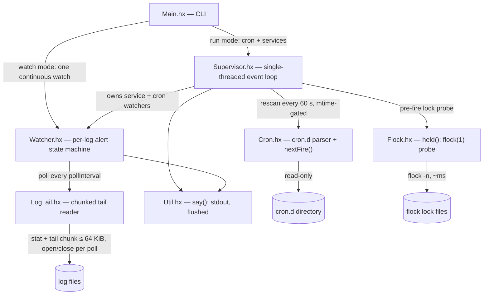
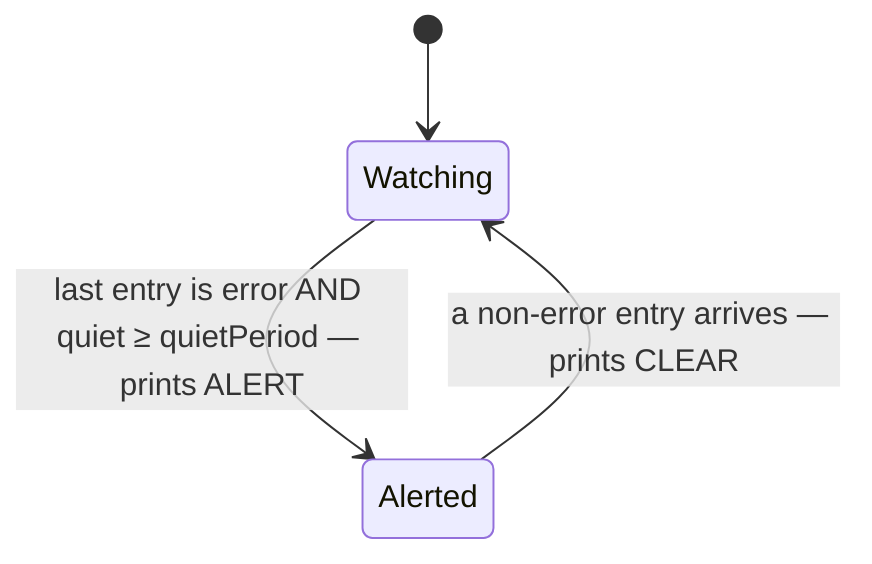
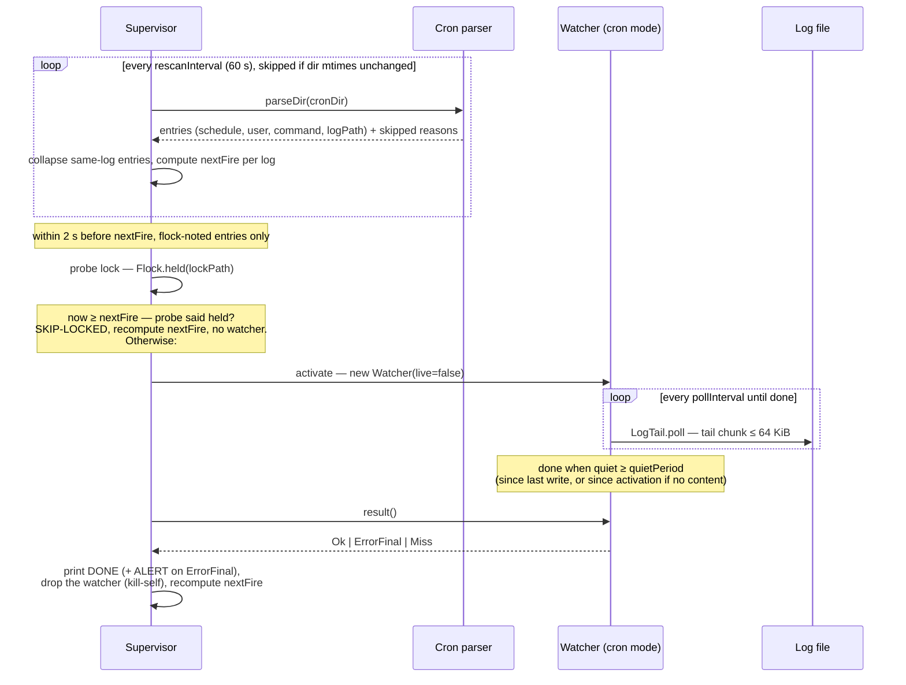
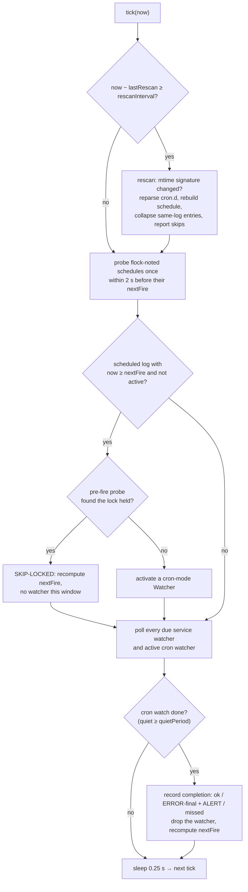
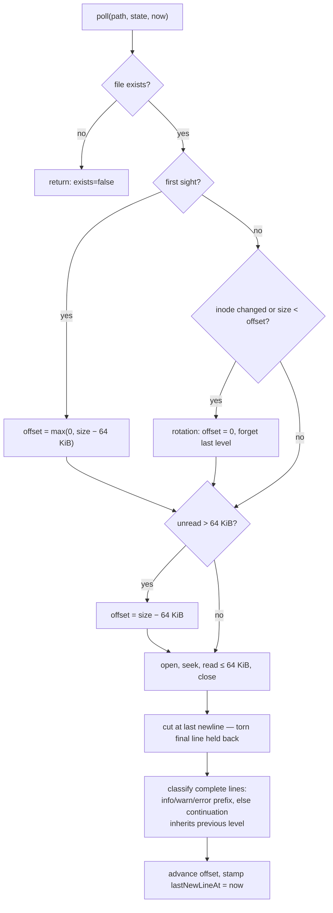

# Diagrams

## Components

```mermaid
flowchart TD
    CLI["Main.hx — CLI"]
    SUP["Supervisor.hx — single-threaded event loop"]
    CRON["Cron.hx — cron.d parser + nextFire()"]
    FLOCK["Flock.hx — held(): flock(1) probe"]
    W["Watcher.hx — per-log alert state machine"]
    TAIL["LogTail.hx — chunked tail reader"]
    UTIL["Util.hx — say(): stdout, flushed"]
    CD[("cron.d directory")]
    LK[("flock lock files")]
    LOGS[("log files")]

    CLI -- "watch mode: one continuous watch" --> W
    CLI -- "run mode: cron + services" --> SUP
    SUP -- "rescan every 60 s, mtime-gated" --> CRON
    CRON -- "read-only" --> CD
    SUP -- "pre-fire lock probe" --> FLOCK
    FLOCK -- "flock -n, ~ms" --> LK
    SUP -- "owns service + cron watchers" --> W
    W -- "poll every pollInterval" --> TAIL
    TAIL -- "stat + tail chunk ≤ 64 KiB, open/close per poll" --> LOGS
    SUP --> UTIL
    W --> UTIL
```

## Service watch — alert state machine

```mermaid
stateDiagram-v2
    [*] --> Watching
    Watching --> Alerted: last entry is error AND quiet ≥ quietPeriod — prints ALERT
    Alerted --> Watching: a non-error entry arrives — prints CLEAR
```

## Cron watch — "alive only when needed"

```mermaid
sequenceDiagram
    participant S as Supervisor
    participant C as Cron parser
    participant W as Watcher (cron mode)
    participant L as Log file

    loop every rescanInterval (60 s), skipped if dir mtimes unchanged
        S->>C: parseDir(cronDir)
        C-->>S: entries (schedule, user, command, logPath) + skipped reasons
        S->>S: collapse same-log entries, compute nextFire per log
    end

    Note over S: within 2 s before nextFire, flock-noted entries only
    S->>S: probe lock — Flock.held(lockPath)
    Note over S: now ≥ nextFire — probe said held?<br/>SKIP-LOCKED, recompute nextFire, no watcher.<br/>Otherwise:
    S->>W: activate — new Watcher(live=false)
    loop every pollInterval until done
        W->>L: LogTail.poll — tail chunk ≤ 64 KiB
    end
    Note over W: done when quiet ≥ quietPeriod<br/>(since last write, or since activation if no content)
    S->>W: result()
    W-->>S: Ok | ErrorFinal | Miss
    S->>S: print DONE (+ ALERT on ErrorFinal),<br/>drop the watcher (kill-self), recompute nextFire
```

## Supervisor tick

```mermaid
flowchart TD
    T["tick(now)"] --> R{"now − lastRescan ≥ rescanInterval?"}
    R -- yes --> RS["rescan: mtime signature changed?<br/>reparse cron.d, rebuild schedule,<br/>collapse same-log entries, report skips"]
    R -- no --> PR
    RS --> PR["probe flock-noted schedules once<br/>within 2 s before their nextFire"]
    PR --> A{"scheduled log with<br/>now ≥ nextFire and not active?"}
    A -- yes --> LK{"pre-fire probe<br/>found the lock held?"}
    LK -- yes --> SK["SKIP-LOCKED: recompute nextFire,<br/>no watcher this window"]
    LK -- no --> ACT["activate a cron-mode Watcher"]
    SK --> P
    ACT --> P
    A -- no --> P["poll every due service watcher<br/>and active cron watcher"]
    P --> D{"cron watch done?<br/>(quiet ≥ quietPeriod)"}
    D -- yes --> F["record completion: ok / ERROR-final + ALERT / missed<br/>drop the watcher, recompute nextFire"]
    D -- no --> E["sleep 0.25 s → next tick"]
    F --> E
```

## Tail poll (one call, one log)

```mermaid
flowchart TD
    S0["poll(path, state, now)"] --> EX{"file exists?"}
    EX -- no --> RET0["return: exists=false"]
    EX -- yes --> FS{"first sight?"}
    FS -- yes --> INIT["offset = max(0, size − 64 KiB)"]
    FS -- no --> ROT{"inode changed or size < offset?"}
    ROT -- yes --> RESET["rotation: offset = 0, forget last level"]
    ROT -- no --> BURST
    INIT --> BURST
    RESET --> BURST{"unread > 64 KiB?"}
    BURST -- yes --> JUMP["offset = size − 64 KiB"]
    BURST -- no --> READ
    JUMP --> READ["open, seek, read ≤ 64 KiB, close"]
    READ --> CUT["cut at last newline — torn final line held back"]
    CUT --> CL["classify complete lines:<br/>info/warn/error prefix, else continuation<br/>inherits previous level"]
    CL --> UPD["advance offset, stamp lastNewLineAt = now"]
```
